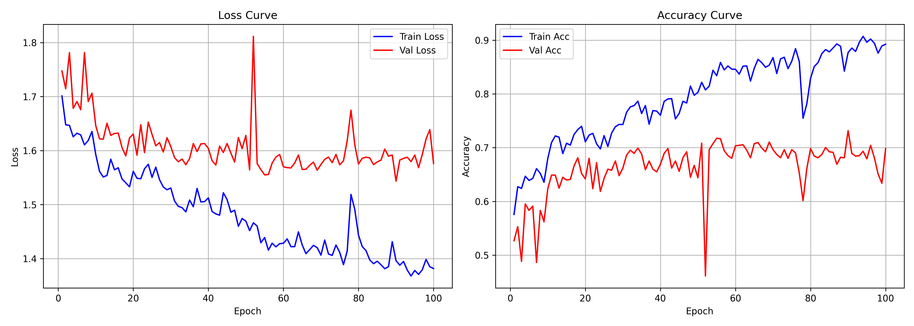
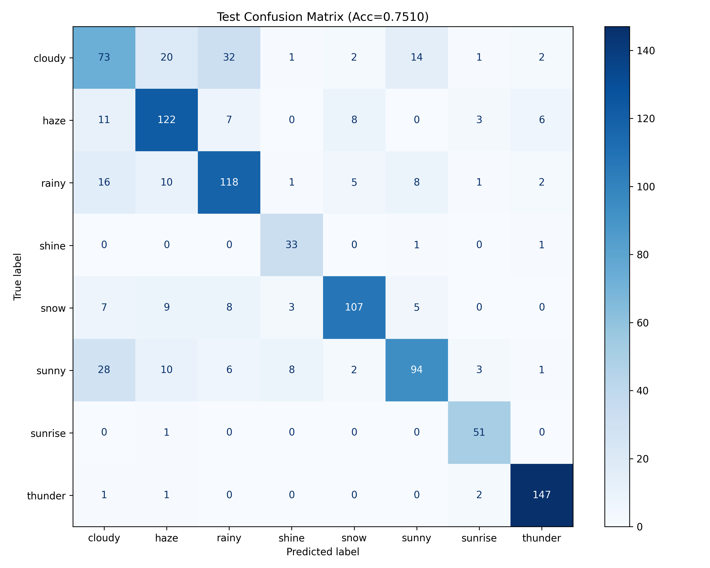

# 多类天气的分类识别

## 数据集说明


### 多类天气图片数据集 (RSCM) — Heywhale

> [1. 多类天气图片数据集 - Heywhale.com](https://www.heywhale.com/mw/dataset/5e732227c59d610036227d89)

|     属性     |                      详情                      |
| :----------: | :--------------------------------------------: |
| **图像总数** |           **60,000 张**（规模最大）            |
|  **类别数**  |        6 类（每类 10,000 张，均衡分布）        |
|   **类别**   | ☀️ 晴天、☁️ 多云、🌧️ 雨天、❄️ 大雪、🌫️ 薄雾、⛈️ 雷雨 |
| **文件大小** |                     1.9 GB                     |
| **原始论文** |              RSCM (IEEE TIP 2017)              |
|   **许可**   |                   CC-BY 4.0                    |

这是三个数据集中**规模最大且类别分布最均衡**的数据集，源自深圳大学林迪等人在 IEEE TIP 上发表的论文，提出了区域选择与并发模型 (RSCM) 用于多类天气识别。

------

### Multi-class Weather Dataset (MWD) — Mendeley Data

>  [2. Multi-class Weather Dataset for Image Classification - Mendeley Data](https://data.mendeley.com/datasets/4drtyfjtfy/1)

|     属性     |                             详情                             |
| :----------: | :----------------------------------------------------------: |
| **图像总数** |                           1,125 张                           |
|  **类别数**  |                             4 类                             |
|   **类别**   | 🌅 Sunrise（日出）、☀️ Shine（晴朗）、🌧️ Rain（雨天）、☁️ Cloudy（多云） |
| **文件大小** |                           91.2 MB                            |
|   **机构**   |                  University of South Africa                  |
|   **许可**   |                          CC BY 4.0                           |

这是一个**轻量级小型数据集**，适合快速原型验证和算法测试。已被引用 8 次，在 Mendeley 上有超过 3.7 万次浏览和 7,600 余次下载。

---

### Weather Phenomenon Database (WEAPD) — Harvard Dataverse

> [3. 数据集（WEAPD）.rar- 哈佛Dataverse](https://dataverse.harvard.edu/file.xhtml?fileId=5378810&version=1.0)

```shell
# 下载数据集-3 

curl.exe -C - -L -o "WEAPD_dataset.rar" "https://dataverse.harvard.edu/api/access/datafile/5378810"
```


|     属性     |                             详情                             |
| :----------: | :----------------------------------------------------------: |
| **图像总数** |                           6,862 张                           |
|  **类别数**  |                    **11 类**（类别最多）                     |
|   **类别**   | 🧊 冰雹、❄️ 雪、⚡ 闪电、🌈 彩虹、🌧️ 雨、💧 露水、🌪️ 沙尘暴、🌫️ 雾/霾、🧊 霜、🌲 雾凇、🧊 雨凇 |
| **文件大小** |                           592.2 MB                           |
| **发布平台** |                   Harvard Dataverse (2021)                   |
|   **许可**   |               **CC0 1.0**（公共领域，最宽松）                |

这是**覆盖天气现象类型最全面**的数据集，配套提出了 MeteCNN 深度卷积神经网络，在该数据集上达到了约 **92%** 的分类精度。

------

📊 三数据集对比速览

| 对比维度 |    RSCM    |    MWD    |  WEAPD   |
| :------: | :--------: | :-------: | :------: |
| 图像总数 | **60,000** |   1,125   |  6,862   |
| 类别数量 |     6      |     4     |  **11**  |
| 类别均衡 |   ✅ 均衡   |  不均衡   |  不均衡  |
| 文件大小 |   1.9 GB   |  91.2 MB  | 592.2 MB |
|   许可   | CC-BY 4.0  | CC BY 4.0 | **CC0**  |
|   特点   |  规模最大  | 轻量验证  | 类别最全 |

> **选择建议**：需要大规模均衡数据选 **RSCM**；快速原型验证选 **MWD**；需要细粒度天气现象分类选 **WEAPD**。

---

## 规划

- **第一阶段：大数据预训练**
 用 RSCM 六类作为主数据集：sunny、cloudy、rainy、snowy、haze、thunder。

- **第二阶段：补充极端天气**
   从 Weather Image Recognition 里抽取 fog/smog、rain、snow、sandstorm、lightning 等类别；从 DAWN/ACDC 补充真实雨雪雾场景。

## 开源复现

### weather-recognition

> [mengxianglong123/weather-recognition: Pytorch深度学习基础 实战天气图片识别（基于ResNet50预训练模型，超详细）](https://github.com/mengxianglong123/weather-recognition)

#### 数据集说明

详见：[数据处理说明文档](./github/weather-recognition/docs/DATASET.md)

|    类别     |  总数量   |     原始来源      |
| :---------: | :-------: | :---------------: |
|   cloudy    |   1,000   |    RSCM + MWD     |
|    haze     |   1,000   |       RSCM        |
|    rainy    |   1,000   |    RSCM + MWD     |
|  **shine**  |  **253**  | **MWD（数量少）** |
|    snow     |   1,000   |       RSCM        |
|    sunny    |   1,000   |       RSCM        |
| **sunrise** |  **356**  | **MWD（数量少）** |
|   thunder   |   1,000   |       RSCM        |
|  **合计**   | **6,609** |                   |

---

|    数据集     |  样本数   |
| :-----------: | :-------: |
| 训练集（70%） |   4,626   |
| 验证集（15%） |    991    |
| 测试集（15%） |    992    |
|   **总计**    | **6,609** |

#### 优化内容

##### FP16 训练加速、卷积运算与数据读写的优化

因为我用的数据集比较大（8*1000），差不多这样的数据集，而原来的代码是直接全部一次性读取到内存空间的，导致资源占用大，并且训练也没有做加速，导致整体训练在我更换了数据集之后较慢，具体为一个 `epoch` 都需要差不多10分钟。


所以做了一些优化，详见：[训练优化记录文档](./github/weather-recognition/docs/OPTIMIZATION.md)

最终优化到了一个`epoch`在`30-60s`区间。


#### 训练日志


##### model_A 基准模型与结果*

###### 训练结果


---



---


###### 测试结果



---


###### 推理结果


`cloudy` 的 10351ms 包含了模型**首次加载后 GPU kernel 编译的冷启动时间**，不是真正的推理速度。cuDNN 在第一次 forward 时会自动搜索并编译最快算法，后续才恢复正常。需要把**冷启动时间**单独记录，下面是调整后的：


```
冷启动耗时记录
========================================
模型路径: ./model\model_1\best_model_1.pt
模型加载耗时: 267.58 ms
GPU 预热耗时: 9711.91 ms
冷启动总耗时: 9979.48 ms
```


###### 结果分析与优化

能够看出来模型还是存在过拟合的，并且**在多分类的时候存在类别偏好**，大概率是这些类别比较容易识别，而有的类别比较难识别，需要特殊处理一下，不然模型的效果还是不理想。

| 类别       | 第 1 轮    |  第 2 轮   | 样本量（测试集） |   识别评价   |
| ---------- | ---------- | :--------: | :--------------: | :----------: |
| c**loudy** | **49.65%** | **50.34%** |   **143~145**    |  **⚠️ 最差**  |
| haze       | 78.31%     |   77.71%   |     157~166      |     较好     |
| **rainy**  | **64.05%** | **75.78%** |   **153~161**    | **中等偏下** |
| shine      | 95.00%     |   94.29%   |      35~40       |   数据量少   |
| snow       | 76.62%     |   76.98%   |     139~154      |     较好     |
| **sunny**  | **58.21%** | **61.84%** |   **134~152**    |   **较差**   |
| sunrise    | 100.00%    |   98.08%   |      52~53       |   数据量少   |
| thunder    | 95.30%     |   97.35%   |     149~151      |     最好     |

发现的`2`个可能的问题：

1. **类别特征可分性差异极大**

|      层级       |             类别              |  准确率  | 特征鲜明度 |
| :-------------: | :---------------------------: | :------: | :--------: |
| **T1 特征鲜明** | `thunder`、`sunrise`、`shine` | 95%~100% |     高     |
| **T2 特征一般** |        `haze`、`snow`         | 77%~78%  |    中等    |
| **T3 特征模糊** |  `cloudy`、`sunny`、`rainy`   | 50%~76%  |     低     |

**T1 类别特征鲜明的合理解释**：

- `thunder`（雷雨）：强烈明暗对比、闪电/乌云特征、独特的光照模式
- `sunrise`（日出）：橙红色调主导、暖色系、高饱和度，视觉上高度一致
- `shine`（晴朗）：光照均匀、阴影清晰、场景明亮

这些类别的准确率高**并非统计偏差**，而是因为它们的视觉特征足够独特，在特征空间中与其它类别距离足够远，模型很容易区分。

**真正的问题集中在 T3**：

- `cloudy`（多云）：灰白色调为主、纹理均匀、缺乏明显特征
- `sunny`（晴天）：明亮但色调多变，可能泛白或偏蓝
- `rainy`（雨天）：湿润反光表面、雨滴纹理，颜色可能在灰（阴天）和蓝（晴雨）之间变化

这三个类别之间的**视觉边界非常模糊**，尤其是 `cloudy` 和 `sunny` 在特征空间中高度重叠，导致互相误判率极高。

2. **低样本类准确率"虚高"**

|  类别   | 测试集样本数 | 准确率 |                           实际情况                           |
| :-----: | :----------: | :----: | :----------------------------------------------------------: |
| sunrise |    52~53     |  99%   | ⚠️ 数据量极少（仅约 356 张原始数据，测试集分配 53 张，训练集更少），准确率高更多是因为样本量小、特征分布集中，而非模型真正学得好 |
|  shine  |    35~40     |  95%   | 同样问题：原始数据仅 253 张，模型在训练时见到该类样本的次数远少于其他类别 |
| cloudy  |   143~145    |  50%   |   样本量充足，但准确率最低，说明模型对该类特征学习严重不足   |

> **结论**：`sunrise` 和 `shine` 虽然准确率高，但测试集样本数很少（各 40~53 张），这个高准确率可能存在较大的统计偏差风险，一旦实际部署遇到更多样化的 sunrise/shine 图片，准确率很可能下降。

---

所以下面对于这里的`2`个问题进行探究与尝试解决。

###### 各个类别的可辨别程度

我的想法是通过**斯皮尔曼相关性热力图**和**原始数据-模型提取的特征数据的T-SNE降维结果图**来反应不同类别间的一个原始的相关性以及特征层面，模型学习的到的特征区分的能力，从而判断少量但是准确率高的结果是统计差异性还是特征的高可分性，以及直观的展示不同类别的分布相似性。

- 相关性热力图


这完美印证了之前的分析：

- **T1 类（雷雨 97%、日出 99%、晴朗 95%）** — 与其他类相关性普遍 < 0.6，特征鲜明
- **T3 类（多云 50%、晴天 60%）** — 彼此间相关性 > 0.93，像素空间几乎无法区分
- **薄雾（77%）** — 介于两者之间，但与晴天/多云高度重叠导致准确率受限

相关性热力图说明：**类别识别困难的根本原因在于像素层面的高相关性**，不是模型能力问题，而是数据本身的视觉边界模糊。

- 特征降维图


可以看到 sunrise（日出）、shine（晴朗） 是特征易于区分，而非前面所说的统计问题。

---

故下面的重点在于如何增强模型对于难分辨类别的识别。

考虑：**Focal Loss — 替代 CrossEntropyLoss**

让模型更关注困难样本（cloudy、sunny、rainy），降低简单样本（thunder、shine）的权重。

##### model_B 替换损失函数为 Focal Loss

######  训练结果

```
训练时间: 2026-05-16 18:43:43
模型目录: ./model\model_2

--- 训练配置 ---
  epochs         : 100
  batch_size     : 128
  learning_rate  : 0.001
  device         : cuda:0
  loss_function  : FocalLoss (gamma=2.0)
  alpha_weights : 
      cloudy: 1.4598
        haze: 0.9323
       rainy: 1.1366
       shine: 0.7702
        snow: 0.9526
       sunny: 1.2487
     sunrise: 0.7321
     thunder: 0.7678
--- 训练结果 ---
  最佳 epoch     : 91/100
  最佳验证准确率  : 0.7235
```

---


---


###### 测试结果


---


###### 推理结果


###### 特征可视化


###### 训练结果分析

| 指标 | model_1 (CE Loss) | model_2 (Focal Loss) | 变化 |
|------|------------------|---------------------|------|
| 测试集准确率 | 73.39% | 72.68% | **-0.71%** |
| 测试损失 | 1.5383 | 1.5448 | +0.43% |

---

```text
类别         model_1      model_2      变化        评价
--------------------------------------------------------------
cloudy      49.65%      52.47%      +2.82%      ✓ 改善
haze        78.31%      66.91%     -11.40%      ✗ 显著下降
rainy       64.05%      66.67%      +2.62%      ✓ 改善
shine       95.00%      89.13%      -5.87%      ✗ 明显下降
snow        76.62%      75.51%      -1.11%      ○ 基本持平
sunny       58.21%      65.00%      +6.79%      ✓✓ 显著提升
sunrise    100.00%      98.55%      -1.45%      ○ 轻微下降
thunder     95.30%      92.72%      -2.58%      ○ 轻微下降
--------------------------------------------------------------
```

**困难类别（优化目标）：**

- ✓ cloudy +2.82%（49.65% → 52.47%）
- ✓✓ sunny +6.79%（58.21% → 65.00%）— 最大受益者
- ✓ rainy +2.62%（64.05% → 66.67%）

**简单类别（非目标）：**

- haze 下降 11.40% 最严重——过度"放弃"了本来能学好的样本
- shine 下降 5.87%，thunder 下降 2.58%

> 详见[优化测试1的说明文档](github\weather-recognition\docs\FOCAL_LOSS_OPTIMIZATION.md)

###### 参数调优对比 —— γ


| 类别 | Model 1 | Model 2 | Model 3 | Model 4 | Model 5 | Model 6 | Model 7 |
|------|---------|---------|---------|---------|---------|---------|---------|
| | CE | γ=2.0 | γ=1.5 | **γ=1.0** | γ=1.75 | γ=1.25 | γ=0.5 |
| cloudy | 0.5055 | 0.5133 | 0.4769 | **0.5732** | 0.5105 | 0.5028 | 0.5233 |
| haze | 0.7124 | 0.7291 | 0.7128 | 0.6667 | 0.7292 | 0.7077 | 0.6174 |
| rainy | 0.6825 | 0.6859 | 0.6627 | **0.7219** | 0.7143 | 0.6599 | 0.6111 |
| shine | 0.8119 | 0.8298 | 0.8211 | 0.8767 | 0.8696 | 0.9014 | 0.0000 |
| snow | 0.7566 | 0.7500 | 0.7786 | **0.7896** | 0.7796 | 0.8103 | 0.8121 |
| sunny | 0.6873 | 0.7250 | 0.7749 | 0.6834 | 0.6667 | 0.6807 | 0.6163 |
| sunrise | 0.8522 | 0.9259 | 0.8952 | **0.9320** | 0.9143 | 0.9000 | 0.8966 |
| thunder | 0.9252 | 0.9408 | 0.9268 | 0.9298 | 0.9263 | 0.9262 | 0.8865 |

详见：[调优对比说明文档-1](./github/weather-recognition/docs/MODEL_COMPARISON.md)

---

观察到一个关键的问题，目前的代码是没有学习率的调度的，是一个固定的学习率，这个需要优化，考虑尝试 Cosine Annealing 调度。

#####  model_B_2 Cosine Annealing 调度学习率

现在还是在测试，还没有一个有效的策略，至少前面的 损失函数  需要再确认一下其的有效性。

下面比较一下学习调度的区别，同时完善了早停策略。

###### 训练结果


###### 测试结果


---

```
========== Per-Class Metrics (P/R/F1) ==========
类别          Precision     Recall         F1    Support
----------------------------------------------------
cloudy         0.5405     0.5556     0.5479        144
haze           0.7532     0.8207     0.7855        145
rainy          0.6687     0.7208     0.6937        154
shine          0.8780     0.8571     0.8675         42
snow           0.8769     0.8382     0.8571        136
sunny          0.7967     0.6806     0.7341        144
sunrise        0.9242     0.9242     0.9242         66
thunder        0.9375     0.9317     0.9346        161
----------------------------------------------------
Macro F1                                 0.7931
Weighted F1                             0.7760
```

###### 结果分析

| 对比项 | Model 4（无调度） | Model 8（CosineAnnealing） | 变化 |
|--------|-------------------|---------------------------|------|
| γ | 1.0 | 1.0 | 相同 |
| 总准确率 | 74.29% | **77.52%** | **+3.23%** |
| Macro F1 | 0.7717 | **0.7931** | **+0.0214** |
| Weighted F1 | 0.7444 | **0.7760** | **+0.0316** |
| cloudy F1 | 0.5732 | 0.5479 | -0.0253 |
| haze F1 | 0.6667 | **0.7855** | **+0.1188** |
| rainy F1 | 0.7219 | 0.6937 | -0.0282 |
| shine F1 | 0.8767 | **0.8675** | -0.0092 |
| snow F1 | 0.7896 | **0.8571** | **+0.0675** |
| sunny F1 | 0.6834 | **0.7341** | **+0.0507** |
| sunrise F1 | 0.9320 | **0.9242** | -0.0078 |
| thunder F1 | 0.9298 | **0.9346** | **+0.0048** |

- **Macro F1 提升 +2.1%**：从 0.7717 → 0.7931
- **haze 大幅提升 +11.9%**：0.6667 → 0.7855（最显著）
- **snow 提升 +6.8%**：0.7896 → 0.8571
- **sunny 提升 +5.1%**：0.6834 → 0.7341
- **thunder 略微提升 +0.5%**：0.9298 → 0.9346

同时：

\- **cloudy 轻微下降**：0.5732 → 0.5479（-2.5%），但仍在可接受范围

\- **rainy 轻微下降**：0.7219 → 0.6937（-2.8%）

CosineAnnealing 学习率调度使模型整体表现大幅提升，**所有简单类（haze、snow、sunny、thunder）均获得明显提升**，而困难类（cloudy、rainy）虽有轻微下降，但整体 Macro F1 仍有 +2.1% 的显著提升。这说明 CosineAnnealing 帮助模型更好地收敛到更优的全局解。

---

说明相比修改损失函数，更改学习率调度策略更加有效。

但是代码还是存在一些问题，主要是：

- 现在相当于把模型输出的概率再次当成 logits 处理，会让 loss 和梯度都变形。
- 没有真正用 ResNet50 的特征层，只是在 **ImageNet 1000 类分类结果的基础上再分类天气**，而不是直接使用 ResNet50 的 2048 维视觉特征。

---

可以补充做：

- 增强训练集
- 用分层划分，保证每类按 70/15/15 分。

##### model_A_2结构纠错与数据增强*

主要是对比进行结构纠正后，数据增强与分层采样的必要性，从而得到一个更正确的基准模型用于后续的比较分析。

###### 训练结果


- 左：model-9
- 右：model-10

---


- 左：model-13
- 右：model-14

###### 测试结果


- 左：model-9
- 右：model-10

---


- 左：model-13
- 右：model-14

###### 结果分析与评价

| 模型 | 数据增强 | 分层划分 | 最佳 epoch | 总准确率 | Macro F1 |
|------|---------|---------|-----------|----------|----------|
| **Model 1** | 无 | 无（random） | — | 73.39% | — |
| **Model 9** | 无 | 无（random） | 18 | **81.15%** | **0.8386** |
| **Model 10** | 有 | 有（70/15/15） | 35 | 81.07% | 0.8342 |
| **Model 13** | 无 | 有（70/15/15） | 85 | 76.13% | 0.7951 |

| 指标 | Model 1 | Model 9 | Model 10 | Model 13 | 13 vs 10 |
|------|---------|---------|----------|----------|----------|
| 总准确率 | 73.39% | **81.15%** | 81.07% | 76.13% | **-4.94%** |
| Macro F1 | — | **0.8386** | 0.8342 | 0.7951 | **-0.0391** |
| Weighted F1 | — | **0.8121** | 0.8108 | 0.7611 | **-0.0497** |
| 最佳 epoch | — | 18 | 35 | 85 | +50 |
| 过拟合程度 | 严重 | 严重 | 轻微 | 中等 | 加重 |

**关键发现：**

- 数据增强对准确率提升 **+4.94%**（Model 10 vs Model 13）

- 无数据增强时（Model 13）收敛更慢（epoch 85 vs 35），且过拟合更明显

- Model 10 = Model 13（无数据增强）+ 数据增强，验证了数据增强的正则化效果

详见：[结构调整优化记录文档](./github/weather-recognition/docs/MODEL_COMPARISON_MAIN.md)

> 所以后面以model-10为基准模型进行对比了。

下面将这里的修改应用到之前的分支中在做的model-8上，再看看效果。

##### model_A_3 学习率调度

之前忘了这回事了，目前的`baseline`还是固定学习率的，由之前的测试结果得到进行调度是有意义的故补充`model-15`，为model- 加上学习率调度的结果。


 

##### model_B_3 结构优化与数据增强后

之前的`model_B`用的错误的网络结构进行训练，这里先进行优化再比较效果，然后比较数据增强与分层采样的必要性。预计比较5个模型。

 	
